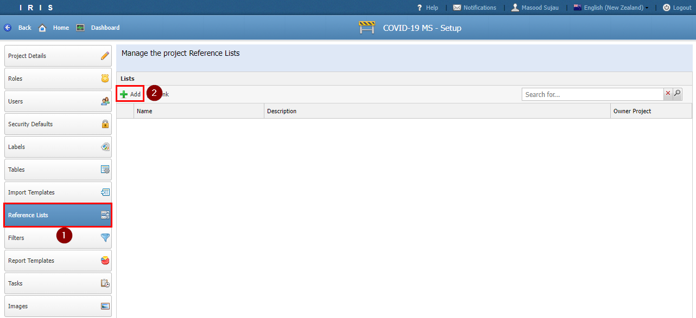
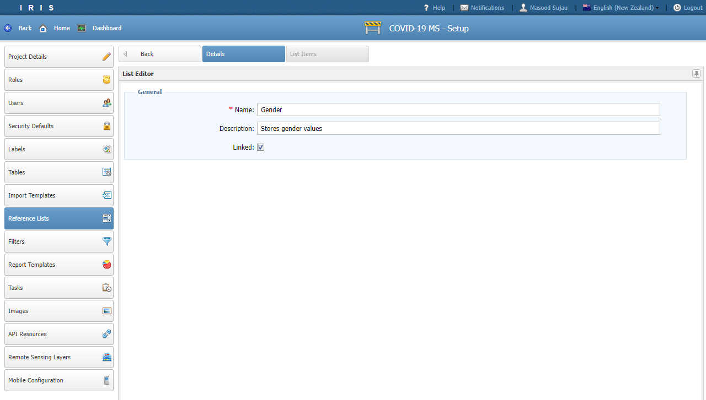
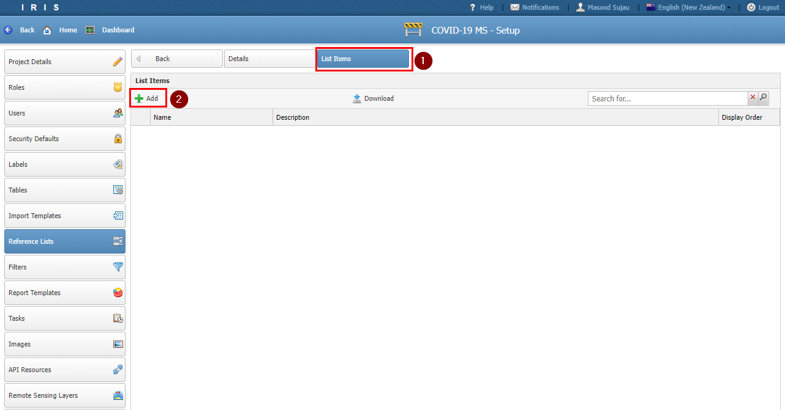
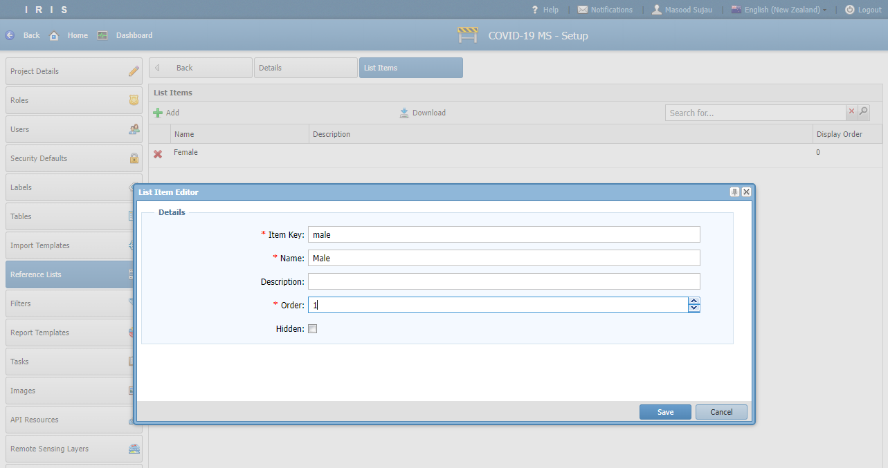
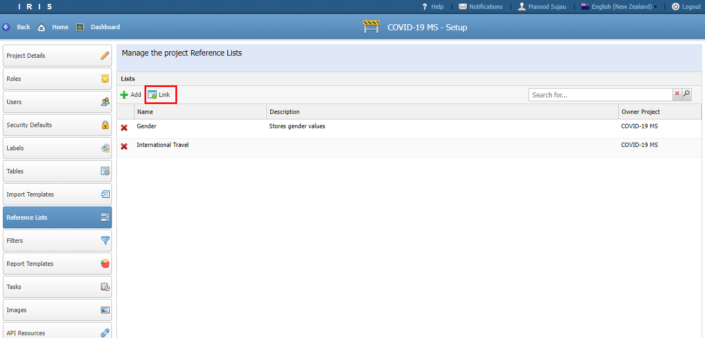
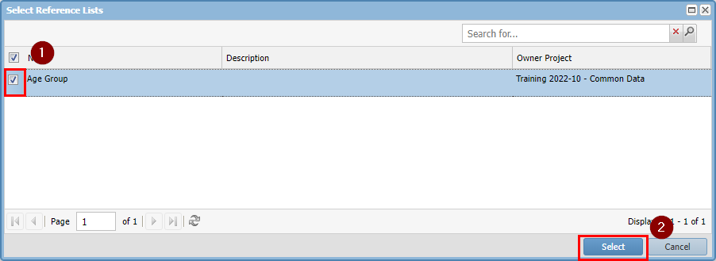
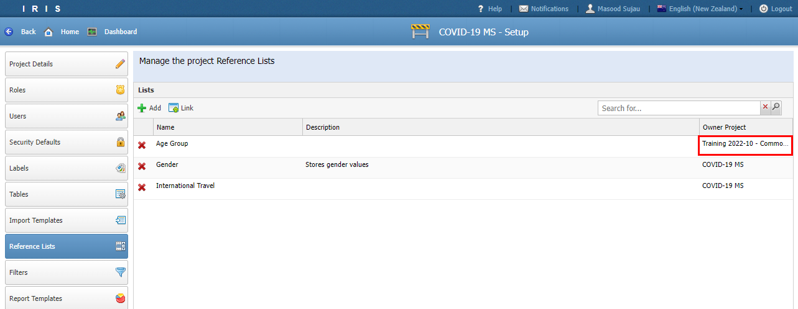
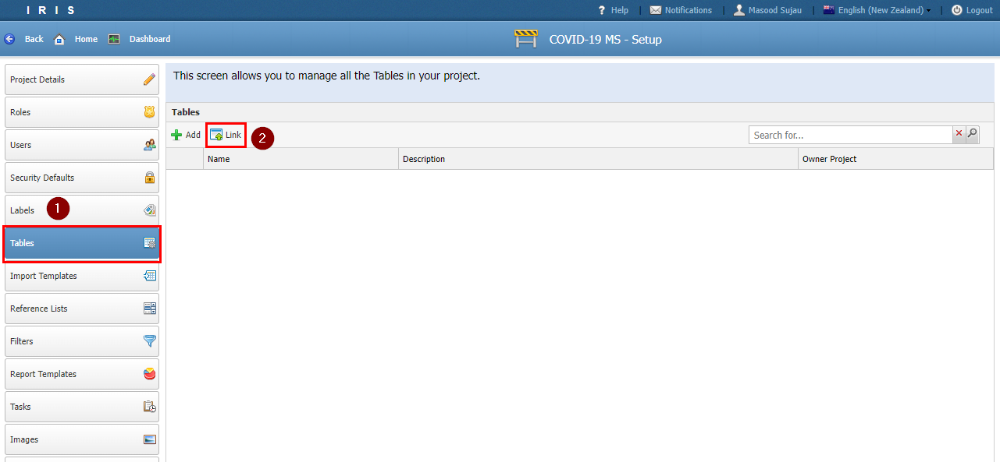
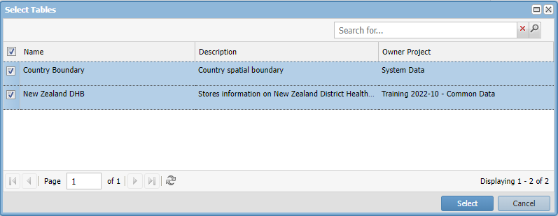

# Tutorial 3

## Data Structures

- In this tutorial we will set up the structures for storing the following look up values
  - Gender
  - International Travel
  - Age Group
  - Status
  - DHB
  - Country

- Look up values can be stored in either Reference Lists or in Tables.

- The choice depends on if there are other attributes that may need to be stored against the look up value e.g. a category or a spatial boundary.

- For this project we already have a table for Country and DHB in the system with full spatial boundaries. We will take advantage of them by linking them to our project.

- The Status look up list will be implemented as a table to demonstrate how to set one up and the rest will be created as Reference Lists.

## Reference Lists

- In this section we will create the lists for Gender, International Travel and Age Group.

- To setup the Gender List, navigate to Reference Lists and click *Add*.

- Enter the following

| Section | Field  | Value | Comment |
| ------------- | ------------- | ------------- | ------------- |
| Details |
|| Name | Gender | |
|| Description | Stores gender values | |

- Click *Save*. 

- Click on the List Itmes tab and click *Add*

- Create the following list items

| Item Key | Name  | Description | Order |
| ------------- | ------------- | ------------- | ------------- |
| female | Female | | 0 |
| male | Male | | 1 |

- Repeat the process to create a list for **International Travel** and create the list items in the table below

| Item Key | Name  | Description | Order |
| ------------- | ------------- | ------------- | ------------- |
| no | No | | 0 |
| yes | Yes | | 0 |

- To save time we have shared the **Age Group** list from the demo project.

- To use a *shared* list click the *Link* button.

- Double click the *Age Group* list row. Or click the check box and hit the *Select* button. If you have too many shared lists you may have to search for it.

- Notice that linked lists have a different Owner Project

## Tables

- Navigate to the **Tables** menu.

- This time let's start by linking in the **Country** and **New Zealand DHB** table.

- Pick the tables and click *Select*

