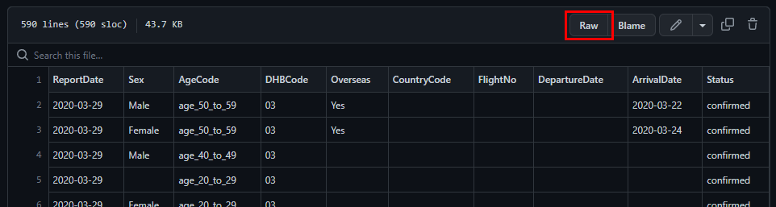
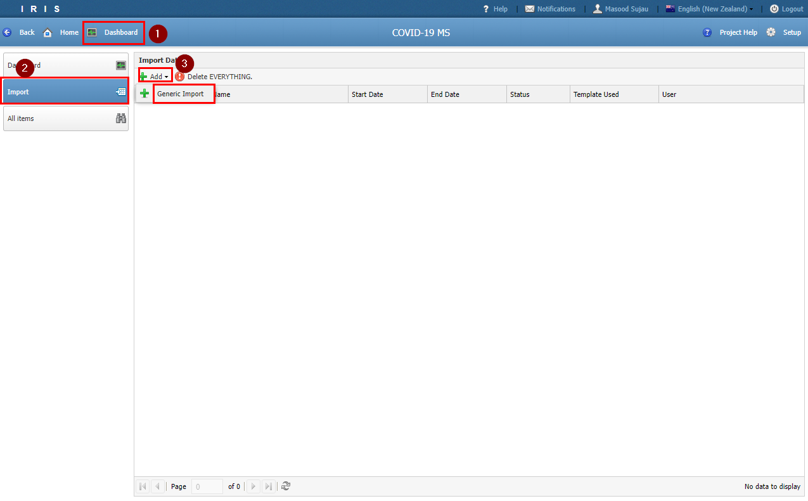
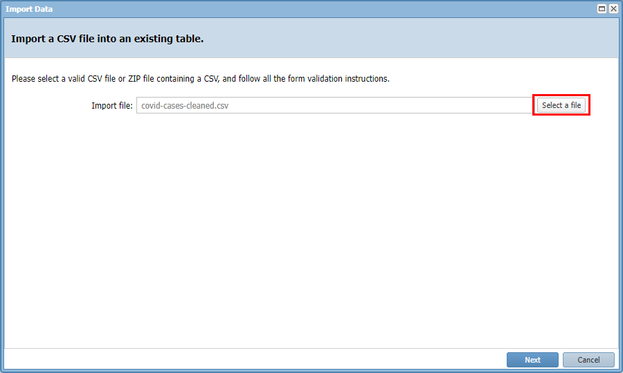
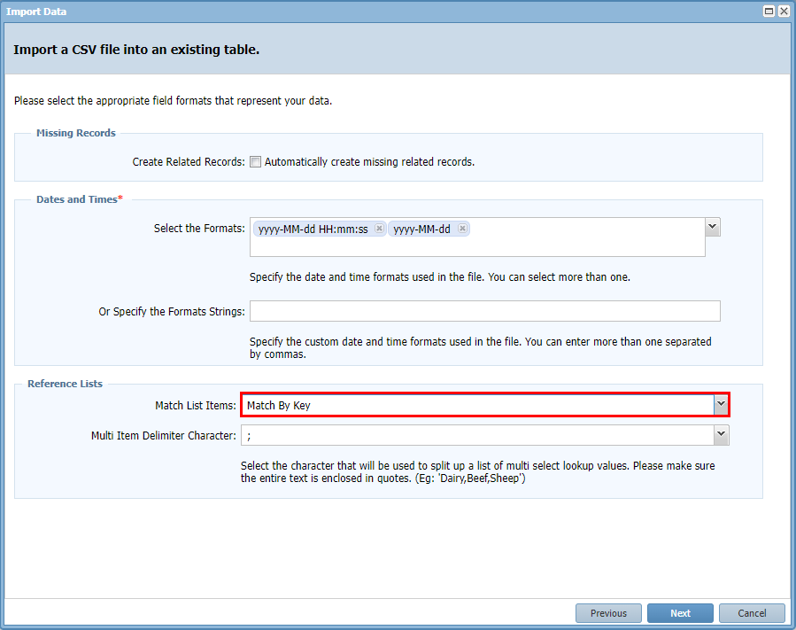
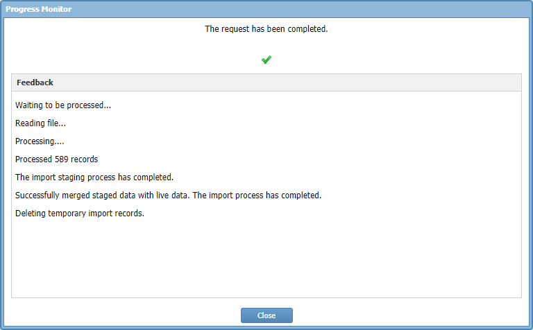
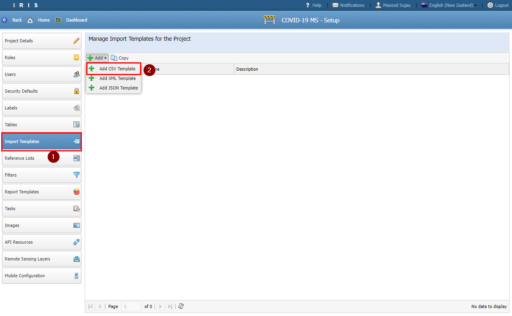

# Tutorial 5

## Data Importing

- IRIS provides two methods for importing CVS data. 
  1. Generic Data Import
  2. Import Templates

- In this tutorial we will import COVID-19 Case data through the Generic Data Importer.

## Generic Data Importer

- Download the cleaned CSV file from [practical/data/covid-cases-cleaned.csv](/practical/data/covid-cases-cleaned.csv)

- If you clicked on the link above then in GitHub click Raw. Next right click and pick *Save As* to save the file.

- In IRIS navigate to *Import* from the *Dashboard*

- Click *Add* and pick **Generic Import**

- Select the downloaded CSV file and click *Next*

- In the *Select Entity Type* drop down pick **COVID-19 Cases**

- Match the CSV Headers to the appropriate fields. Note that for the DHBCode and CountryCode you need to navigate through the tree view to pick the Code and Reference ID columns respectively

- Your mapping should look as follows

- Set the *Match List Items* value to be **Match By Key**. This forces the importer to use the Item Key value instead of the Name value when trying to match entries

- Click *Finish*

- The import process happens in the background and may take a while. If you navigate away you can always come back to check the status.

- The process of setting up an Import Template is very similar. You can find the *Import Template* menu in the Settings section.

- You will need to provide the import template a name and then perform a field mapping as you did previously.

- In the next tutorial we will create a Filter to access the COVID-19 Case table.