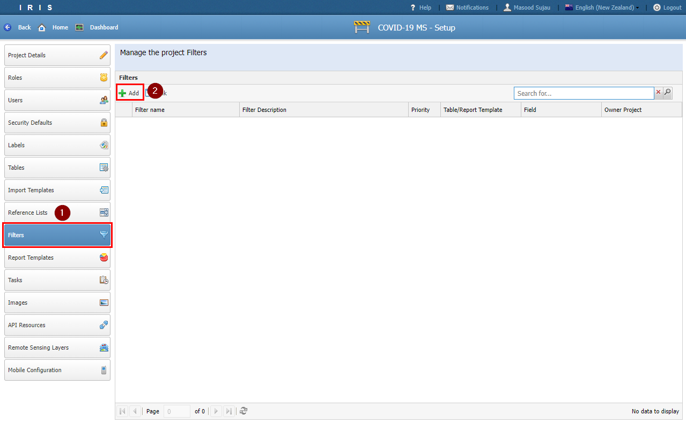
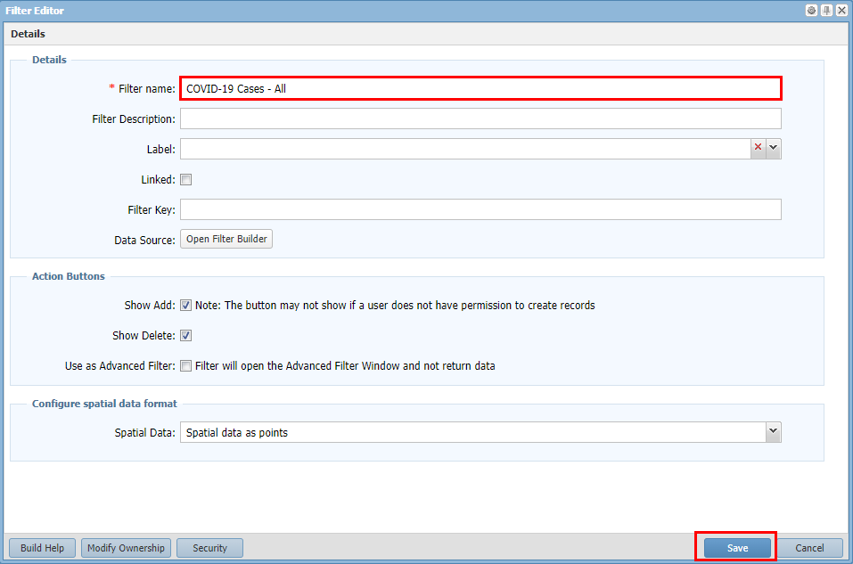
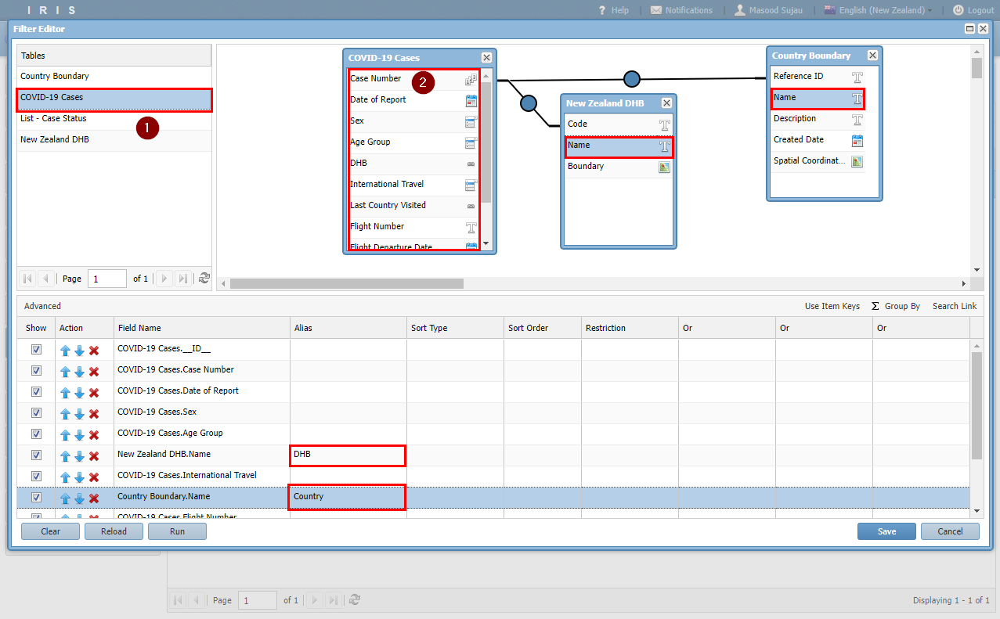
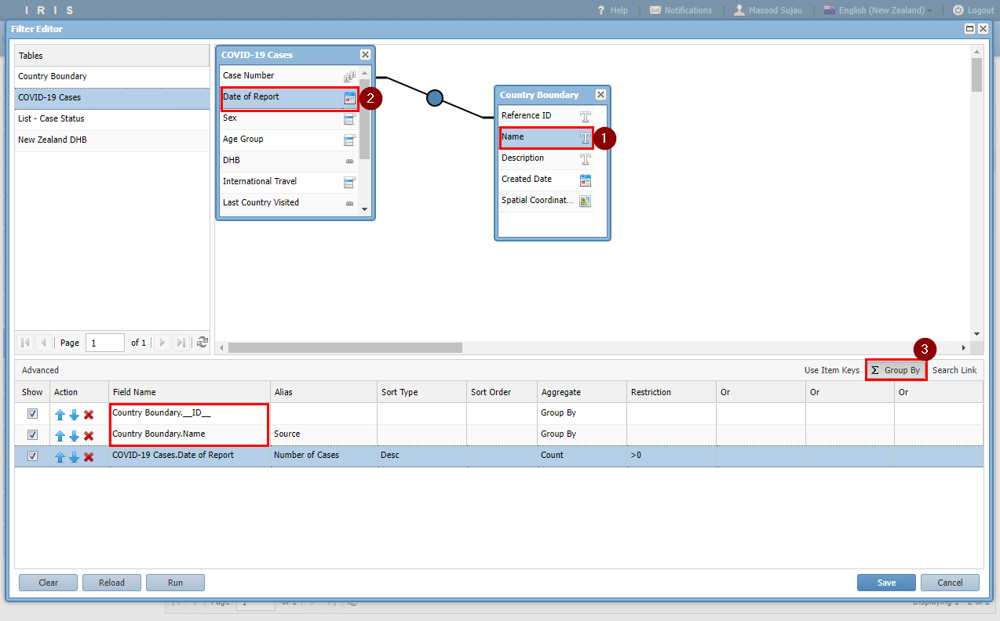
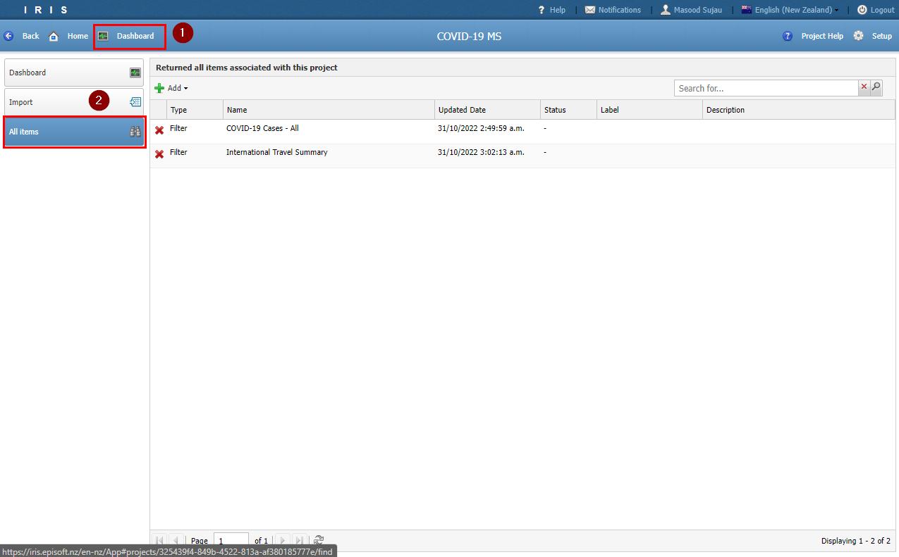
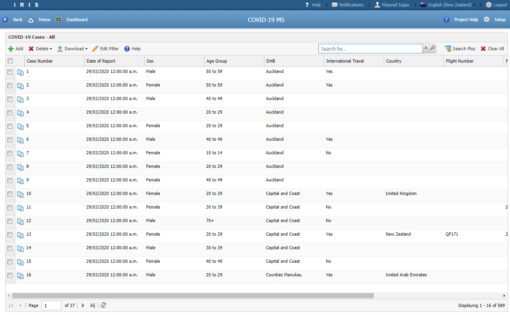

# Tutorial 6

## Filters

- The only way for end users to view data in IRIS is through a Filter or a Report.

- This is to assist with customising the view and only returning the relevant data.

- In this tutorial we will build two filters

### 1. All Cases Filter

- To create a new filter navigate to the *Settings* section and locate the *Filter* menu.

- Click the *Add*

- Enter **COVID-19 Cases - All** as the *Filter name* then click *Save*

- In the *Filter Builder* window double click **COVID-19 Cases** table then double click each of the fields to add them to the *Criteria* panel below.

- When you double click a relationship field the related table is added to the query panel.

- Add an Alias value for DHB and Country name columns

- Click the *Run* button to test the filter.

- Click *Save*

### 2. Internation Travel Summary 

- Repeat the process above to create a filter called **International Travel Summary**

- Replicate the filter builder window below. Take note that the first two columns are from the **Country Boundary** table.

- Clicking the *Group By* button shows the *Aggregate* column.

- Click *Save*

## Viewing Filters

- You can see the filters that were created in the above step by going to the *Dashboard* and clicking on the *All Items* tab.

## Challenge 

- Try and create a filter called **COVID-19 Cases - High Risk** which brings back the same columns as the **COVID-19 Cases - All** but restricts the data to age groups above 60