# Tutorial 6

## Filters

- In IRIS end users always view data through filters.

- This is to assist with customising the view and only returning the relevant columns.

- In this tutorial we will build two filters

- In this tutorial we will build the **Covid-19 Cases** table.

- The **Covid-19 Cases** table will use the Reference Lists and linked Tables from the previous tutorial.

- As the data does not contain any unique identifiers we will create a auto incrementing Case Number

- The table will need to contain the following fields

| Field Name | Comment |
| ------------- | ------------- |
| Case Number | An auto generated number |
| Date of Report |  |
| Sex | Look up using the Sex Reference List |
| Age Group | Look up using the Age Group Reference List |
| DHB | Relationship to the New Zealand DHB table |
| International Travel | Look up using the Internation Travel Reference List |
| Last Country Visited | Relationship to the Country table |
| Flight Number | |
| Flight Departure Date | |
| Flight Arrival Date | |
| Case Status | Look up using the Status Reference List |

## Building Tables

- To create the **Covid-19 Cases** table click on the *Add* button.

- The value for the *Unique Key* field must be unique in the system. It is recommended that you prefix the table name with your project name which includes your initials to avoid confusion e.g. Covid_19_**XX**_Cases

- Fill out the rest of the fields with the values below.

| Section | Field  | Value | Comment |
| ------------- | ------------- | ------------- | ------------- |
| General |
|| Name | Covid_19_MS_Cases | |
|| Description | Stores Covid-19 case information | |
|| Linked | True | Used for exporting project schemas |
| UI Properties |
|| Width | Medium | Width of the window on screen|
|| Height | Large | Height of the window on screen|
|| Save Behaviour on Add New | Save and close form | When a user creates a new record then the editor will close immediately after save |
|| Save Behaviour on Update | Save and close form | When a user updates an existing record then the editor will close immediately after save |
|| Close Behaviour | Close All | Close all pop up windows that were generate from the editor of this table |

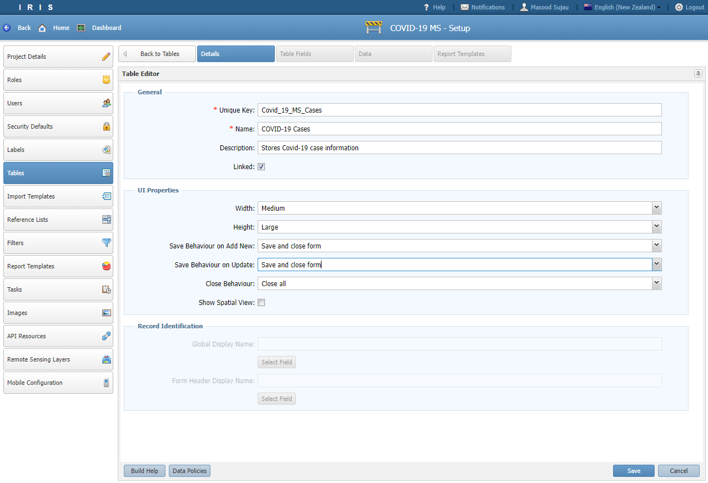

### Configure Data Policy

- The *Data Viewer* role needs to be able to read the data in the **Covid-19 Cases** table

- The *Data Entry* role needs to be able to read and modify the data in the **Covid-19 Cases** table

- We will create two policies. One called **Read Policy** and the other called **Read/Update Policy**

- Click on the *Data Policies* button located on the bottom toolbar. Then click on *Add New Policy*.

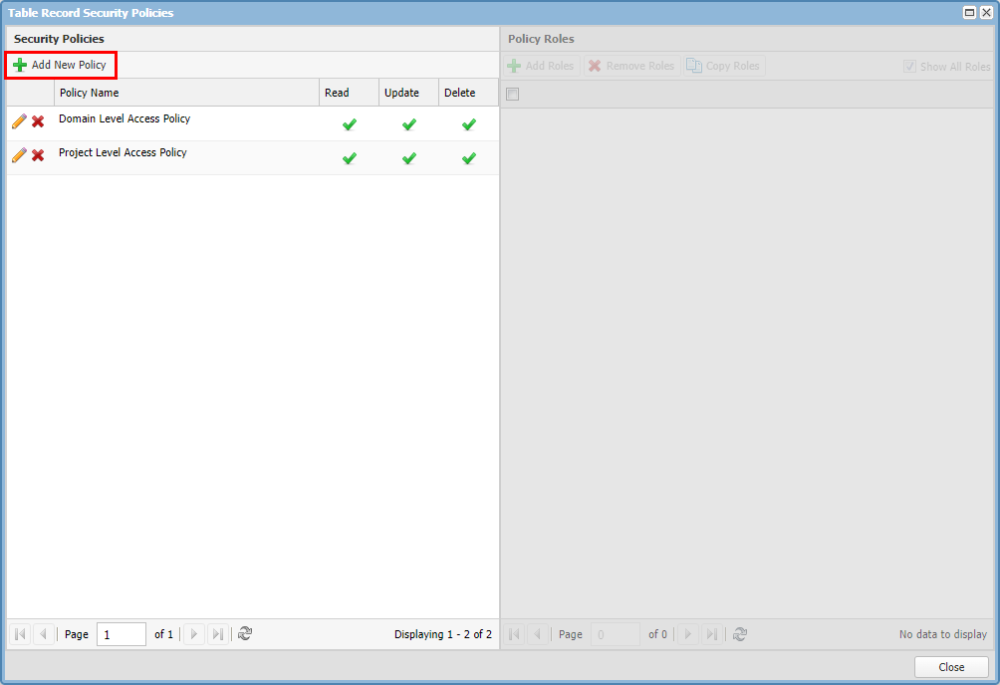

- Set the *Policy Name* to **Read Policy** and tick the *Read* checkbox.

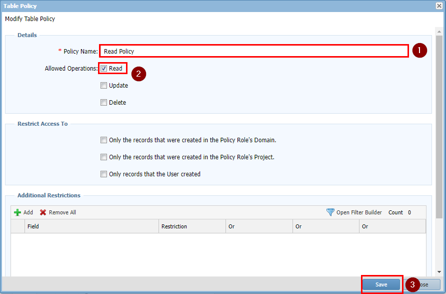

- Next click on the newly created **Read Policy** row and click *Add Roles*.

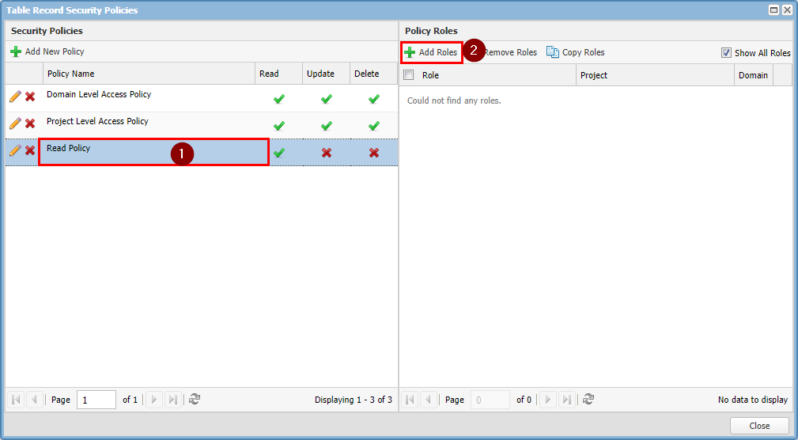

- Select the **Data Viewer** role.

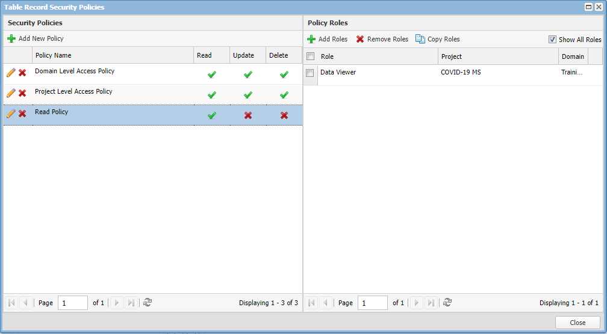

- Now repeat the steps to create the **Read/Update Policy** as shown below.

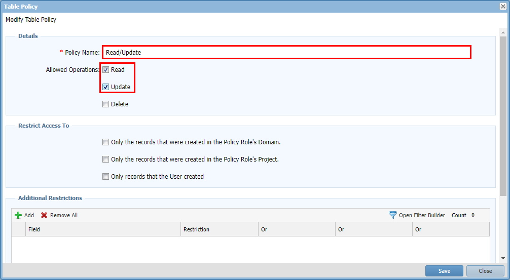

- Add the **Data Entry** role to it.

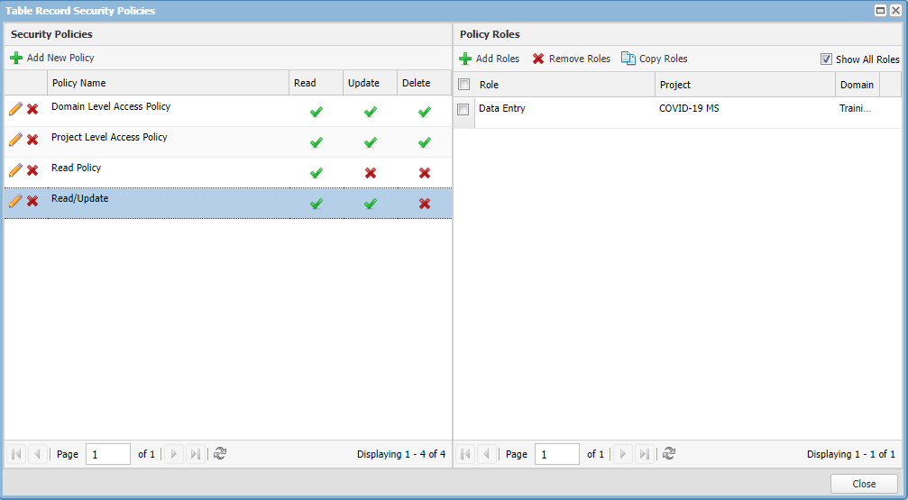

### Adding Fields

- To add fields to the table click on the *Table Fields* tab.

- Click on the **Root** node then click *Add*. 

- Always remember to click on a node before clicking on the “Add” button.

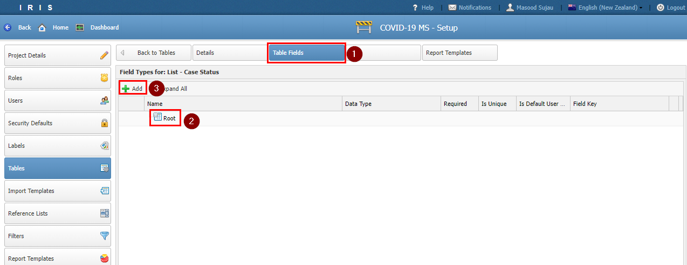

- Enter **Details** as the *Form Name* and click *Save*.

- Click on the **Details** node and then click *Add* to add a section under the form.

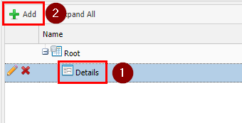

- Click on the **Details** node and then click *Add* to add a section under the form.

- Set the *Name* to **Case Details** and click *Save*.

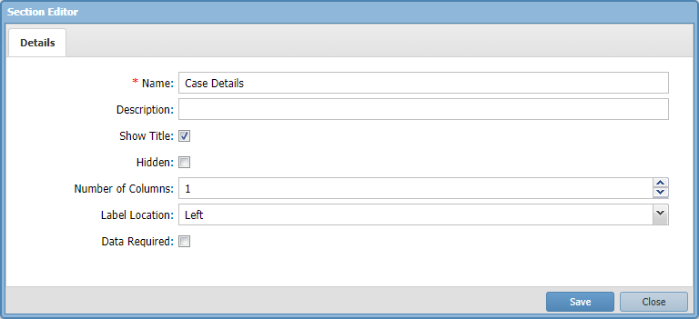

- Click on the **Case Details** node and then click *Add* to add a field under the section.

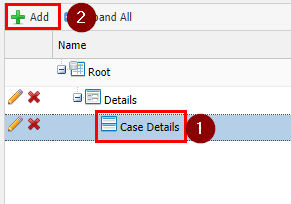

- Start by adding an *Auto Number* field

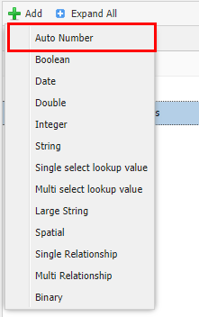

- Fill out the Auto Number field details as shown below. We specify that the field is unique.

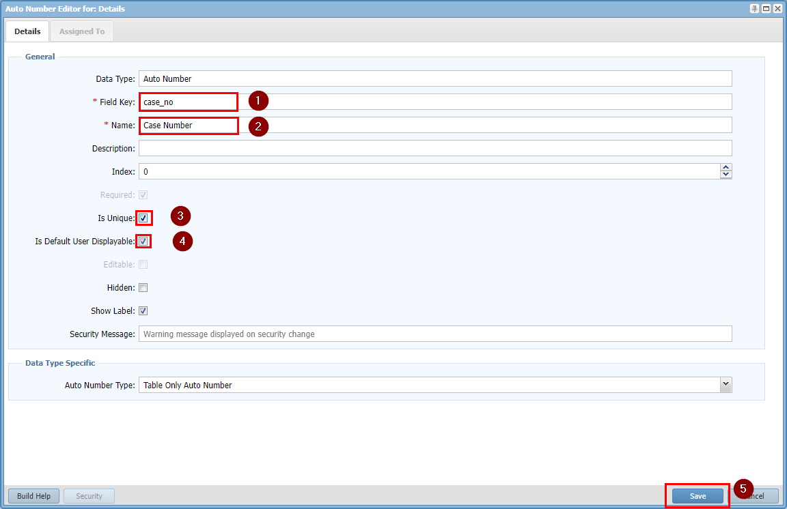

- Try and create fields to match the table below. 

- *Is Default User Displayable* flag is used by the system to determine the fields to show when you have not specified a display field e.g. on a map legend

| Field Key | Name | Data Type | Required | Is Default User Displayable | Reference List | Related Type |
| ------------- | ------------- | ------------- |------------- |------------- |------------- |------------- |
| case_no | Case Number | Auto Number | True | True |||
| date_of_report | Date of Report | Date | True | True |||
| sex | Sex | Single select look up value |||Gender||
| age_group | Age Group | Single select look up value |||Age Group||
| dhb | DHB | Single Relationship ||||New Zealand DHB|
| international_travel | International Travel | Single select look up value ||| International Travel ||
| last_country_visited | Last Country Visited | Single Relationship ||||Country Boundary |
| flight_no | Flight Number | String ||||
| flight_departure_date | Flight Departure Date | Date ||||
| flight_arrival_date | Flight Arrival Date | Date ||||
| case_status | Case Status | Single select look up value ||| Status ||

- Some field details for a Date and a Single select look value are shown below:

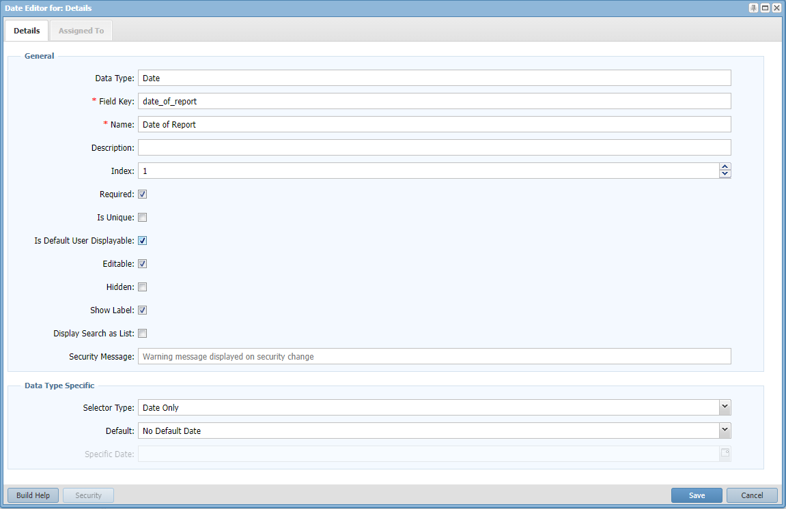
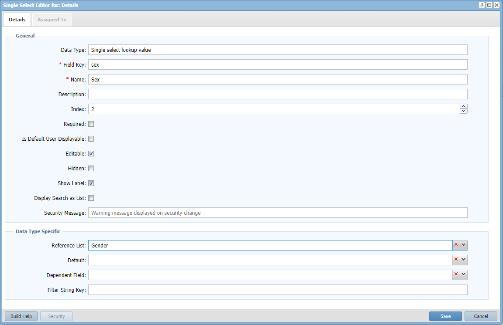

- The relationship fields require more configuration. 
- For the DHB field see the setting below.
- For Last Country Visited field use the same settings as the DHB

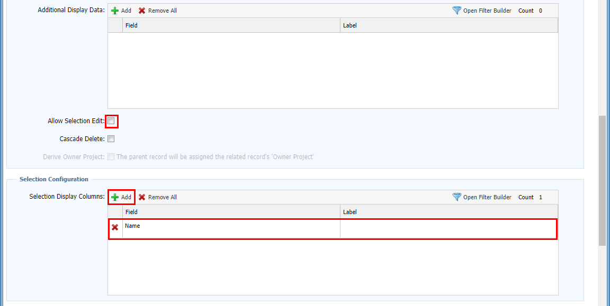
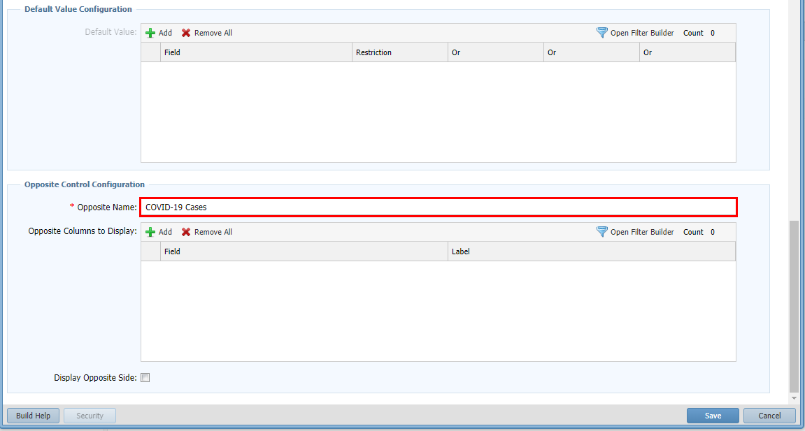

- Once all the fields are added your control tree should look as below
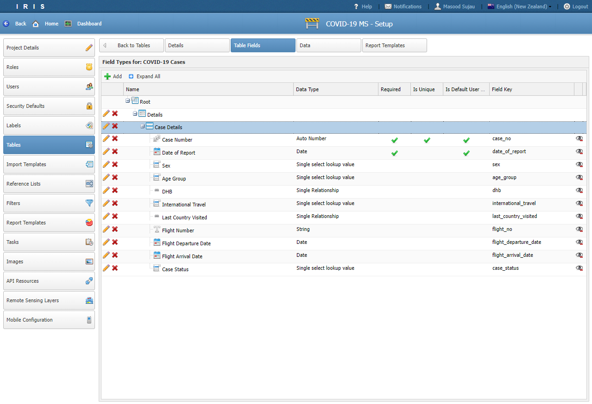

- A quick way to test the form is to go to the *Data* Tab and click the *Add* button.

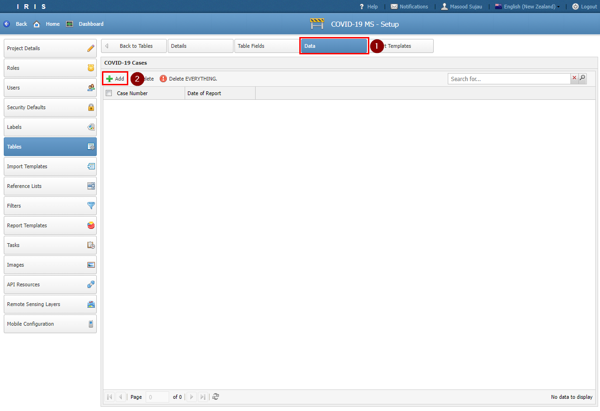

- At the moment there is no way to access the table from the Dashboard view.

- In the next tutorial we will create a Filter to access the COVID-19 Case table.