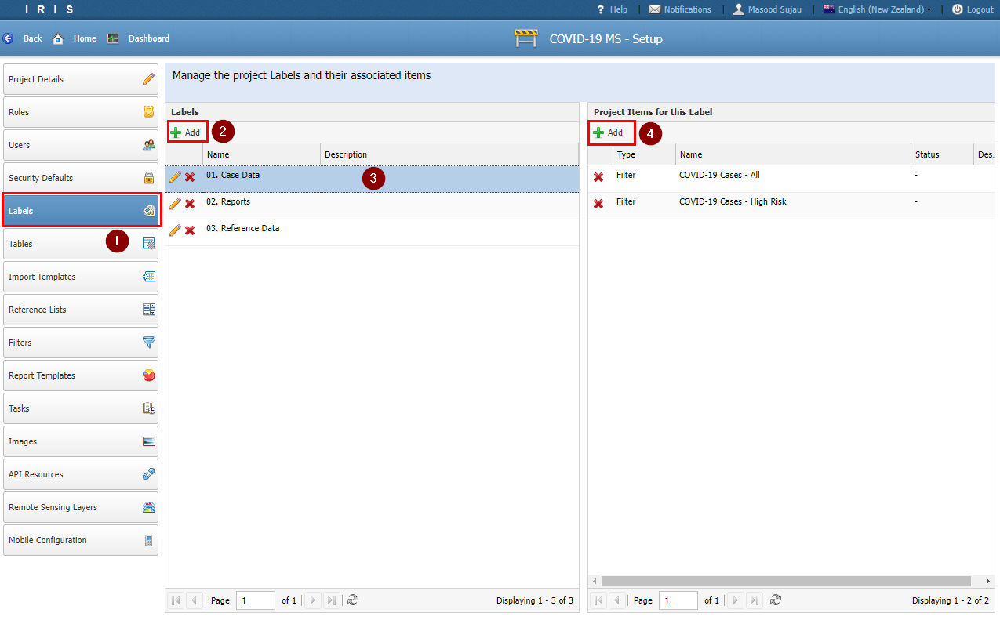
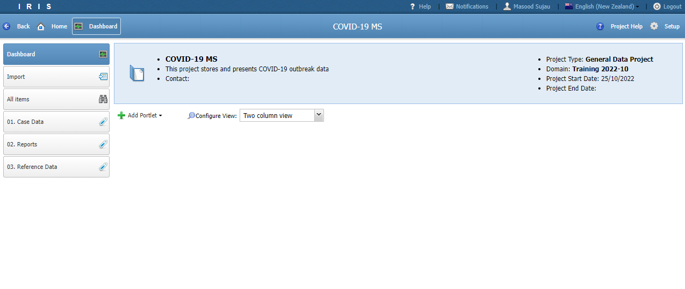

# Tutorial 7

## Labels

- Labels are used to provide a menu system to navigate a project

- In this tutorial we will create the following labels and assign filters created in the previous tutorial to them

  - 01 Case Data
    - COVID-19 Cases - All
    - COVID-19 Cases - High Risk

  - 02 Reports
    - International Travel Summary

  - 03 Reference Data
    - List - Country
    - List - NZ District Health Boards

- To create a new label navigate to the *Settings* section and locate the *Label* menu.

- Click the *Add*

- Enter the label name from the values above and assign the appropriate filters.

- Navigate to the *Dashboard* to view the labels. Note that if a label does not have any items then it will be hidden.

- If the page does not refresh then press F5 on the keyboard

