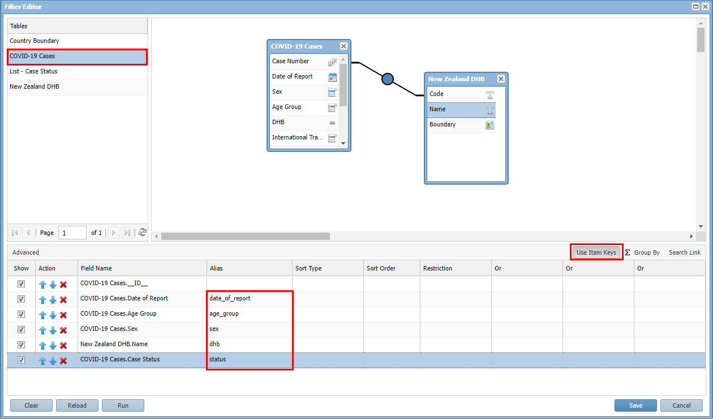
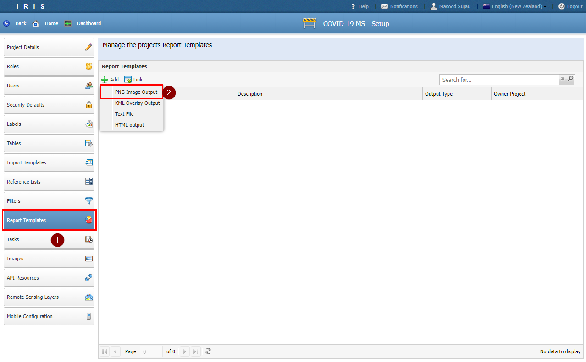
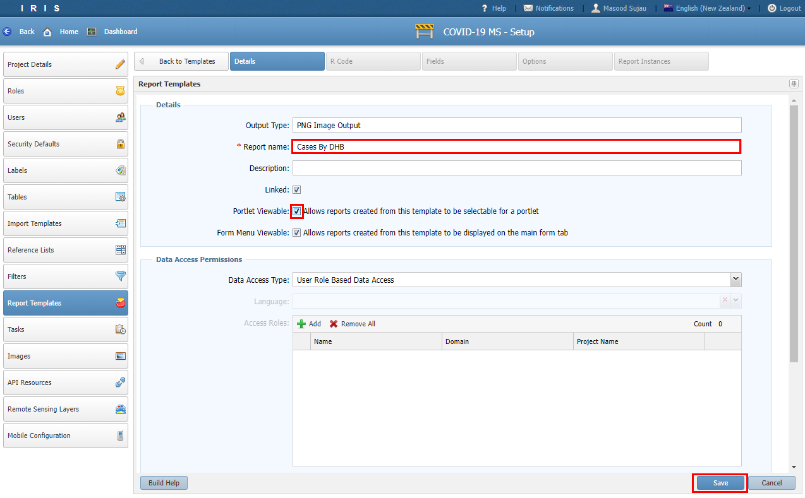
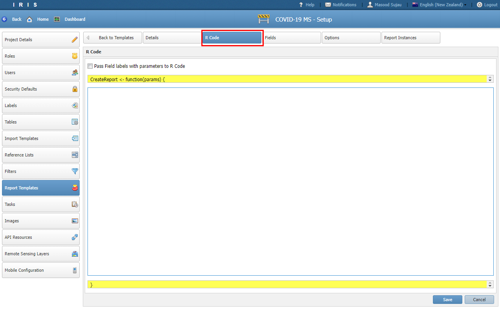
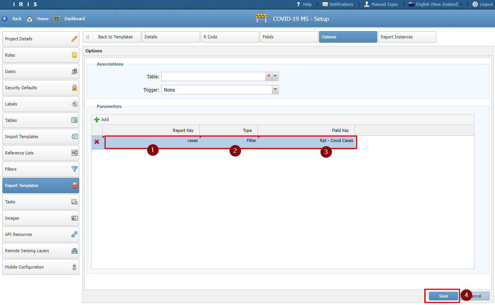
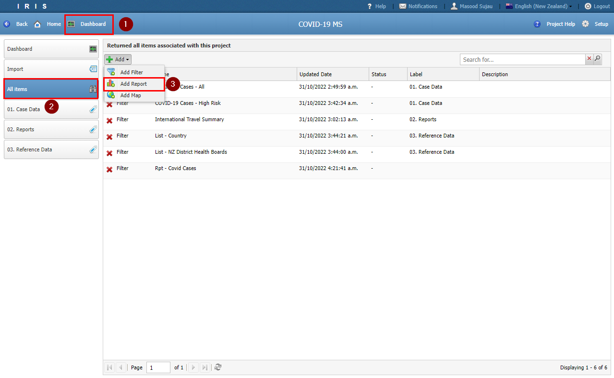
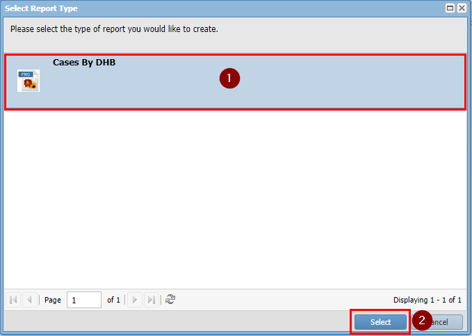
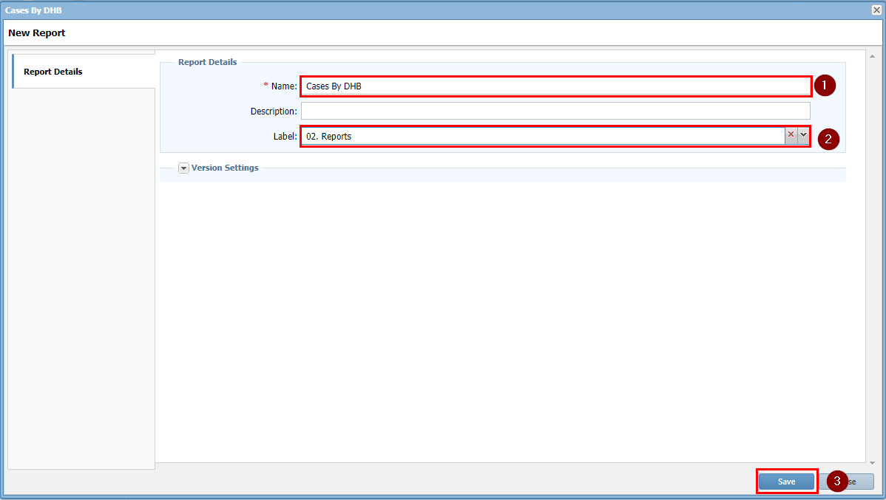
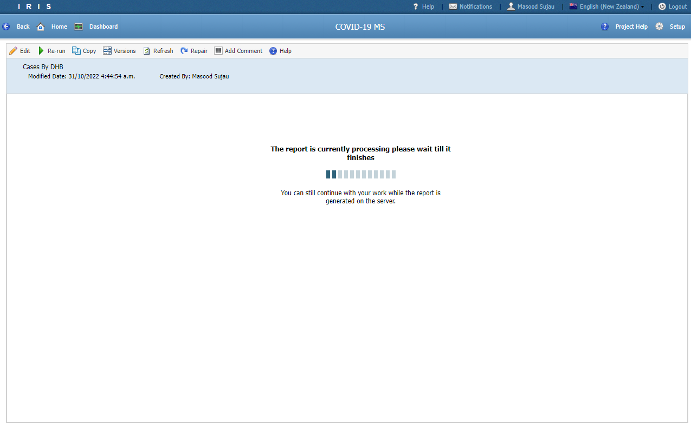
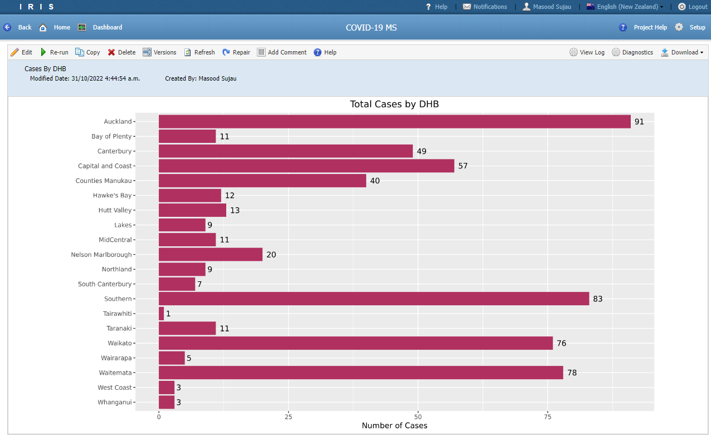

# Tutorial 8

## Building Report Templates

- In this tutorial we will create a report template for displaying case numbers by DHB.

- But before we start building a report template we need to create a filter to supply the data to the template.

- Navigate to *Filters* and create a filter called **Rpt - Covid Cases**.

- Make sure the filter matches the image below


- Next locate the *Report Template* menu.

- Click the *Add* and pick *PNG Image Output*



- Set the *Report name* to Case By DHB and tick the *Portlet Viewable*.

- Click *Save*



- Click *R Code* tab and delete all the code in the box and replace it with code below and click *Save*.



```
#------------ START ------------

outputFileName = "CasesByDHB.png"

#load the libraries but supress any warnings
library(data.table)
library(tidyverse)
library(ggplot2)
library(forcats)

#read the cases CSV file
#reverse the factor order of the dhb column (so in the chart Auckland is at the top)
#group by dhb and get a tally
cases <- fread(params$cases, header = TRUE, sep = ",", stringsAsFactors=TRUE) %>%
        mutate(dhb = fct_rev(dhb)) %>%
        group_by(dhb) %>%
        tally()

#plot the data as a bar chart
ggplot(cases, aes(x = dhb, y = n, label = n)) + 
        ylab("Number of Cases") + xlab("") +
        geom_bar(position="stack", stat="identity", fill="maroon") +
        coord_flip() +
        scale_fill_discrete(name = "Confirmed") +
        geom_text(hjust=-0.4) +
        ggtitle("Total Cases by DHB") +
        theme(
                plot.title = element_text(hjust = 0.5)
        )        

#save the output as an image
ggsave(outputFileName, width = 16*0.75, height = 9*0.75, unit = 'in')

return(outputFileName)

#------------ END ------------
```

- We now need to link the filter we created earlier to the Report Template. 

- Click on the *Options* tab and fill in the *Parameter* section.

- Click *Save*



- To create a *Report* from a *Report Template* we need to navigate to the *Dashboard* and go to the *All Items* menu.

- Click *Add* and choose *Add Report*



- Click *Cases By DHB* and click *Select*.



- Enter **Cases By DHB** as the name and set the *Label* to **02. Report**.

- Click *Save*



- Wait for the report to finish processing. It will happen in the background so even if you close the window you can come back and view it.






