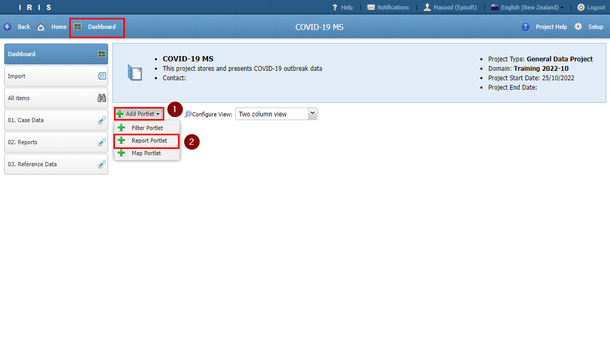
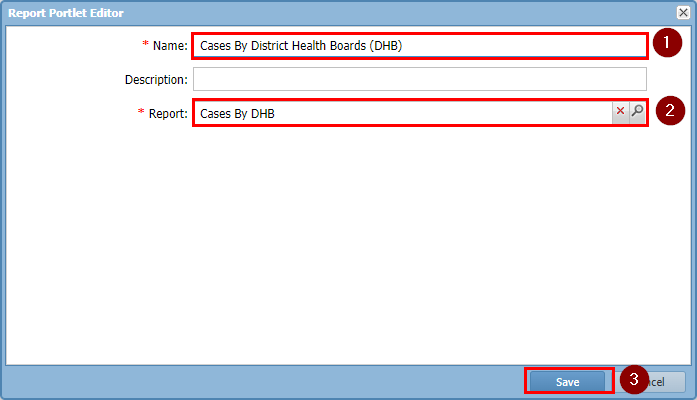
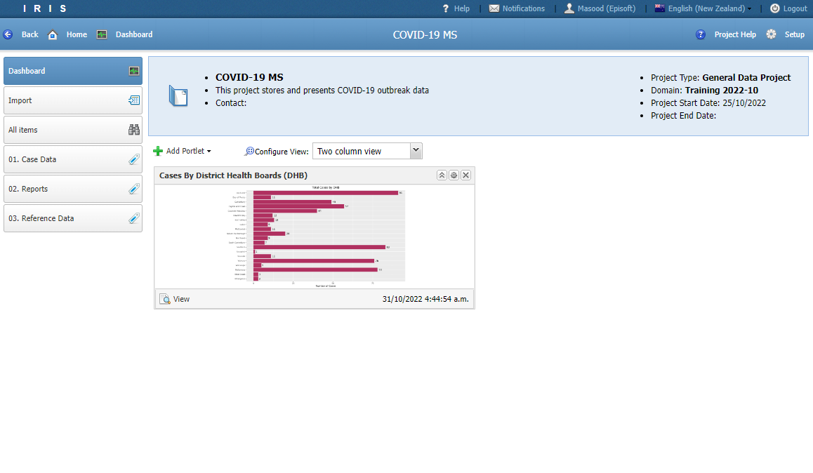
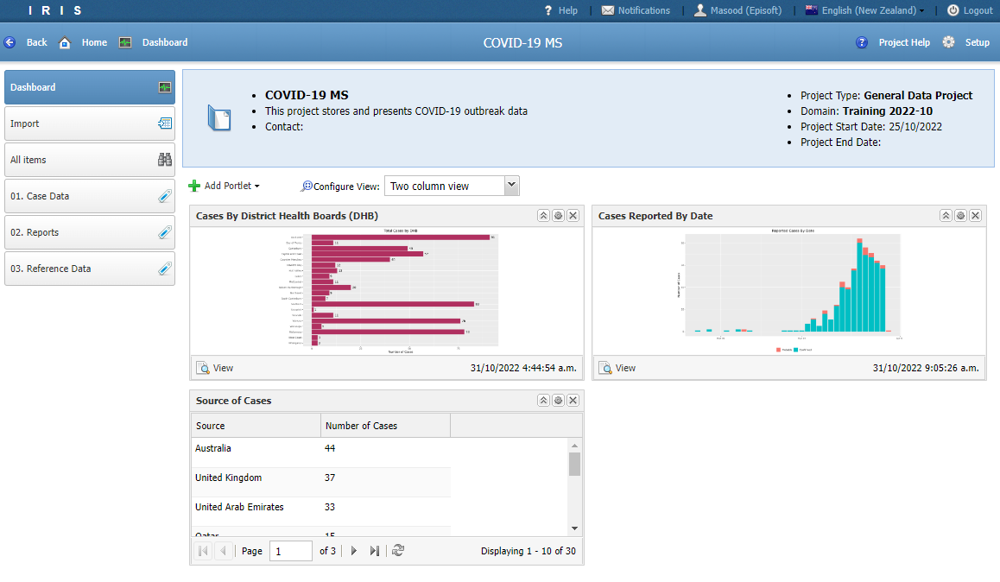
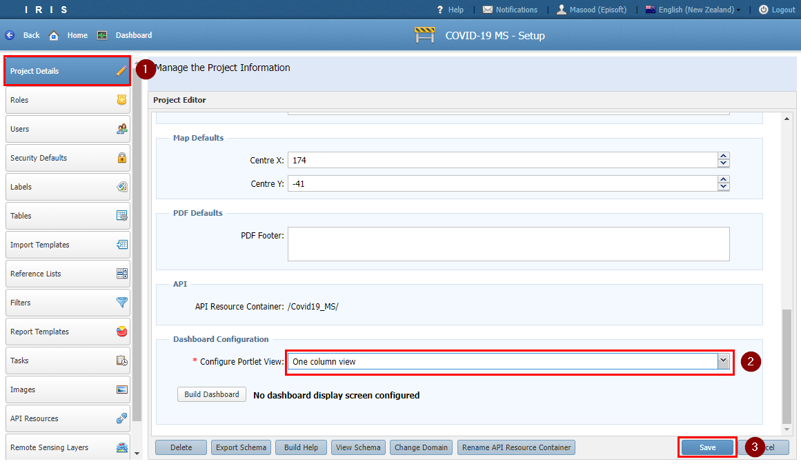

# Tutorial 9

## Configuring the Dashboard

### Adding Portlets

- In this tutorial we will display some of the reports and filters we have generated in the previous tutorials on the dashboard.

- Navigate to the *Dashboard* and click *Add Portlet*.

- In the first portlet we will display the **Cases By DHB** report.

- Set the *Name* to **Cases By District Health Boards (DHB)** and pick the *Report* **Cases By DHB**. 

- The portlet *Name* is the title of the portlet and it does not have to match the *Report* name.

- Repeat the steps to add a portlet for **Cases Reported By Date**.

- Repeat the steps again but this time using *Filter Portlet* to display the **International Travel Summary** filter. 

### Portlet Configuration

- You can set the number of columns to display on the dashboard in the *Setup* screen.

- Navigate to *Setup* > *Project Details* and locate the *Configure Portlet View*. Set it to your preference.

